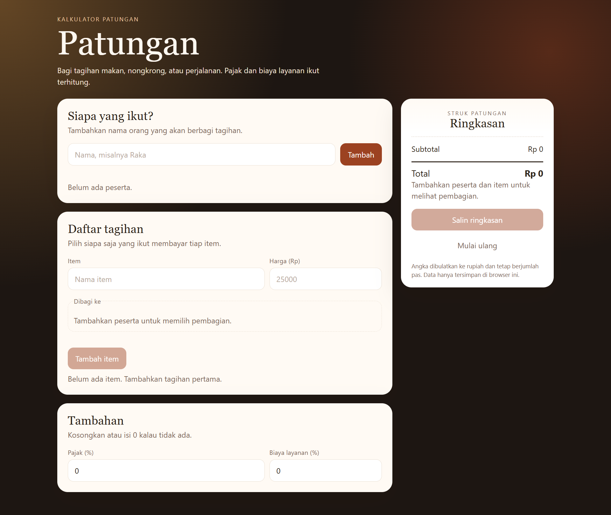

# Patungan

Kalkulator bagi tagihan untuk makan bareng, nongkrong, atau perjalanan. Masukkan siapa yang ikut dan harga tiap item, lalu lihat berapa yang harus dibayar masing-masing — termasuk pajak dan biaya layanan.

## Tampilan

## Fitur

- Tambah peserta dan item tagihan
- Pilih siapa saja yang ikut membayar tiap item
- Pajak dan biaya layanan dibagi proporsional sesuai porsi masing-masing
- Pembulatan ke rupiah yang tetap berjumlah pas
- Ringkasan bisa disalin
- Data tersimpan otomatis di browser lewat localStorage

## Cara menjalankan

Buka `index.html` di browser. Tidak perlu instalasi atau server.
